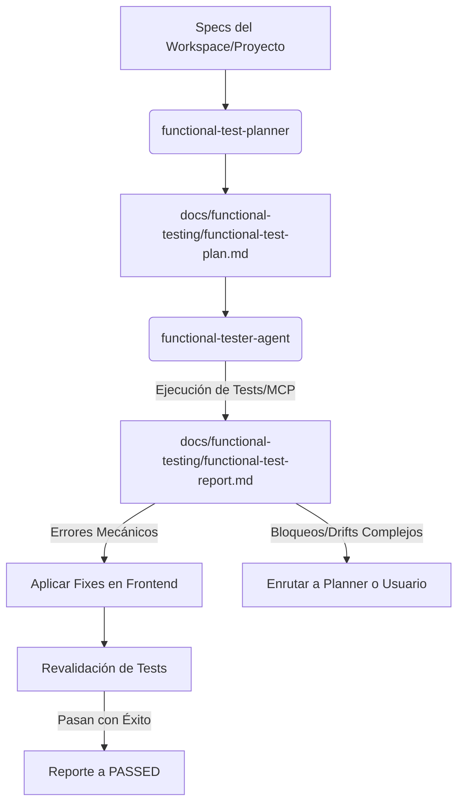

# Functional Testing Standard

Esta skill define el estándar operativo para realizar pruebas funcionales de caja negra y flujos de usuario (E2E) en frontends. Establece las responsabilidades para el diseño del plan de pruebas, la detección de bugs visuales o de flujo, el formato del reporte de errores y el proceso de remediación en el workspace.

## Flujo de Trabajo General



---

## 1. Fase de Planeación y Diseño (Functional Test Planner)

El agente `functional-test-planner` debe analizar las especificaciones del proyecto y construir el archivo:
`docs/functional-testing/functional-test-plan.md`

El formato del plan de pruebas debe ser el siguiente:

```markdown
# Plan de Pruebas Funcionales - Frontend

**Proyecto:** [Nombre del Proyecto]
**Fecha de Creación:** [AAAA-MM-DD]
**Diseñador:** functional-test-planner

---

## 1. Alcance de las Pruebas
Breve resumen de las vistas y funcionalidades del frontend que se validarán.

---

## 2. Escenarios de Prueba Diseñados

### [TS_001] - [Nombre descriptivo del flujo de prueba]
- **Objetivo:** Qué regla de negocio o interacción de UI se valida.
- **Criterio de Aceptación Asociado:** Referencia a la Spec/Requerimiento.
- **Precondiciones:** Estado previo requerido (ej. Usuario autenticado, BD con datos iniciales).
- **Pasos a Seguir:**
  1. Navegar a `/ruta`
  2. Hacer click en `selector-del-boton`
  3. Escribir 'texto' en `selector-de-input`
- **Resultado Esperado:** Elementos visuales, redirecciones o mensajes que deben renderizarse.
- **Selectores UI Recomendados:** Identificadores CSS/XPath sugeridos para facilitar la automatización.

### [TS_002] - [Edge Case - ej. Validación de Error en Formulario]
...
```

---

## 2. Fase de Ejecución y Reporte (Functional Tester Agent)

El agente `functional-tester-agent` consume el plan de pruebas y realiza la verificación a través de:

### A. Pruebas Interactivas vía MCP (Puppeteer)
Útil para validación rápida en caliente y exploración visual.
1. **Lanzamiento de App**: Levantar el dev server si no está activo:
   ```bash
   pnpm run dev
   ```
2. **Navegación e Interacción**: Usar el MCP `puppeteer` para ejecutar secuencialmente los pasos de cada escenario del plan.
3. **Verificación Visual**: Tomar capturas de pantalla (`puppeteer_screenshot`) ante fallos.
4. **Verificación de Consola**: Inspeccionar errores de consola JS o fallos de red.

### B. Pruebas Automatizadas del Workspace (Playwright / Cypress)
Útil para la suite de integración local del frontend.
1. **Dependencias**: Instalar herramientas mediante `pnpm` si no están instaladas:
   ```bash
   pnpm add -D @playwright/test
   pnpm exec playwright install
   ```
2. **Ejecución**: Correr la suite automatizada:
   ```bash
   pnpm playwright test
   ```

Si se detectan errores funcionales, el tester generará el archivo de reporte:
`docs/functional-testing/functional-test-report.md`

El formato exacto del reporte debe ser:

```markdown
# Reporte de Pruebas Funcionales - Frontend

**Última Actualización:** [AAAA-MM-DD HH:MM:SS]
**Estado Global:** [FAILED / PASSED]
**Ejecutor:** functional-tester-agent

---

## 1. Resumen de Ejecución
- **Total Tests Ejecutados:** X
- **Pasados:** Y
- **Fallados:** Z
- **Entorno de Red:** [Localhost / Staging / Mocked]

---

## 2. Errores Detectados

### [ID_ERROR] - [Nombre descriptivo del error]
- **Componente / Ruta:** `/ruta-de-la-app` o `src/components/ComponentName`
- **Escenario Asociado:** [TS_00X]
- **Comportamiento Esperado:** Descripción clara de lo que debería hacer el frontend.
- **Comportamiento Actual:** Descripción detallada del fallo.
- **Evidencia (Consola / Red / UI):** Logs o screenshots en `docs/functional-testing/screenshots/error-id.png`.
- **Causa Raíz Sospechada:** [Drift de API, error de binding, estilo roto, validación incompleta, etc.]
- **Estado:** [TODO / IN_PROGRESS / FIXED / BLOCKED]

---

## 3. Plan de Remediación
- **Acciones sugeridas:** Qué código modificar o si requiere derivar el caso.
- **Asignado a:** [functional-tester-agent / executor / planner / usuario]
```

---

## 3. Ciclo de Corrección y Validación (Remediación)

1. **Triage y Clasificación**:
   - **Fix Mecánico (Frontend)**: Si el fallo reside puramente en el cliente (clase CSS errónea, binding roto, validación básica de JS), el propio `functional-tester-agent` aplica la corrección.
   - **Bloqueo (Backend / Diseño)**: Si la resolución requiere modificar la estructura del API (OpenAPI) o reglas de negocio críticas de backend, marcar el error como `BLOCKED` con la justificación y enrutar al `planner` o al usuario.
2. **Aplicación del Fix**: Modificar los archivos del frontend respetando la arquitectura limpia del framework.
3. **Re-validación**: Correr las pruebas funcionales de nuevo. Si pasan, actualizar el estado del error a `FIXED` y el estado global a `PASSED`.

---

## 4. Criterios de Aceptación del Entregable
1. El archivo `docs/functional-testing/functional-test-plan.md` y `docs/functional-testing/functional-test-report.md` deben existir.
2. Todos los errores identificados deben estar en estado `FIXED` o `BLOCKED` con justificación formal.
3. Al finalizar, el servidor de desarrollo del frontend debe apagarse si fue iniciado por los agentes.
