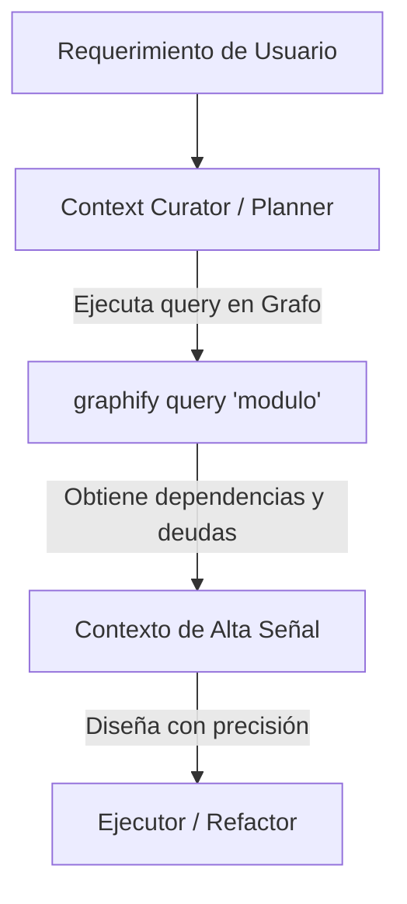

# Estándar de Gobernanza de Grafos de Conocimiento (Graphify)

Este estándar define las políticas y directrices para la creación, mantenimiento y explotación de los grafos de conocimiento generados con **Graphify** (`graphify-out/`) en el ecosistema de desarrollo de software gobernado por agentes.

---

## 1. Ciclo de Vida del Grafo: Creación e Inicialización

Para evitar que los agentes trabajen con mapas inexistentes o incompletos, se definen las siguientes reglas de inicialización:

### A. Inicialización del Grafo
- **Momento:** Al configurar un nuevo Workspace o Proyecto Local, el agente `enterprise-architect` (en Workspace) o `planner` (en Proyecto Local) debe inicializar el grafo.
- **Comando base:**
  ```bash
  graphify install --project
  graphify --update
  ```
- **Filtros de Exclusión (Evitar Ruido):**
  - Graphify debe configurarse respetando el `.gitignore`.
  - Queda estrictamente prohibido indexar directorios como `node_modules`, `vendor`, `target`, `build`, `.git`, `.gemini`, `logs` o carpetas temporales.

### B. Estructura de Salida
Cada repositorio o subproyecto que utilice Graphify debe mantener el directorio `graphify-out/` en la raíz de su espacio de trabajo, con los siguientes componentes mínimos:
- `graph.json`: Estructura del grafo en formato JSON (Fuente de RAG para agentes).
- `GRAPH_REPORT.md`: Reporte legible por humanos y agentes que destaca god nodes, comunidades y dependencias.

---

## 2. Protocolo Anti-Drift (Mantenimiento y Sincronización)

El mayor riesgo del uso de grafos de conocimiento es el **desfasamiento (drift)** entre el código real y el grafo. Si un agente modifica el código pero no actualiza el grafo, los agentes subsiguientes tomarán decisiones basadas en información obsoleta.

### A. Políticas de Actualización en el SDLC
1. **Pre-flight / Curation Gate (Inicio del Incremento):**
   - El agente `context-curator` o `planner` debe realizar un chequeo rápido de actualización ejecutando:
     ```bash
     graphify --update
     ```
     para asegurar que cualquier cambio manual realizado por el desarrollador humano u otros procesos sea integrado antes de generar el plan técnico.
2. **Post-execution Gate (Fin del Incremento):**
   - Después de que el `executor` o `refactor` modifique los archivos de código fuente, y antes de transferir el flujo a `final-validation`, se debe actualizar el grafo de forma incremental:
     ```bash
     graphify --update
     ```
   - Esto garantiza que el nuevo estado del código quede documentado en `graph.json` y `GRAPH_REPORT.md` para las validaciones arquitectónicas.

### B. Integración con Git y Control de Versiones
Para evitar la inflación del repositorio de Git con binarios innecesarios de visualización, se establece la siguiente política de commits para el directorio `graphify-out/`:
- **Archivos que DEBEN ser commiteados:**
  - `graphify-out/graph.json` (Esencial para la persistencia RAG de los agentes).
  - `graphify-out/GRAPH_REPORT.md` (Para revisión rápida y curación de contexto).
- **Archivos que DEBEN ignorarse (`.gitignore`):**
  - `graphify-out/*.html` (Visualizaciones pesadas).
  - `graphify-out/*.svg` / `*.png` / `*.graphml` (Exportaciones gráficas).
  - `graphify-out/obsidian/` (En caso de exportación de notas masiva).
  - `graphify-out/.graphify_python` / `.graphify_root` (Configuraciones de entorno local).

---

## 3. Directrices de Uso para Agentes (Explotación de Contexto)

La directriz fundamental es: **"El grafo es el mapa del territorio; consúltalo antes de explorarlo a ciegas."**



### A. Optimización de Tokens en la Curación de Contexto
- **Prohibición de Lectura Masiva:** Los agentes tienen prohibido realizar búsquedas `grep` masivas o abrir archivos de código completos para comprender la estructura global.
- **Protocolo de Consulta:**
  1. El agente `context-curator` debe consultar primero el `graphify-out/GRAPH_REPORT.md` para obtener una visión macro (God Nodes, comunidades funcionales).
  2. Para consultas específicas sobre relaciones de dependencia, debe invocar:
     ```bash
     graphify query "cómo interactúa el módulo X con Y"
     ```
  3. Para resolver caminos de afectación ("si cambio X, qué toco"):
     ```bash
     graphify path "ModuloOrigen" "ModuloDestino"
     ```

### B. Intersección con la Deuda Técnica
- Al planificar un incremento, el `planner` debe buscar específicamente si los nodos de código a modificar se intersectan o tienen relación directa con los nodos de Deuda Técnica (`technical-debt` nodes o referencias al archivo `technical_debt.md`). Esto evitará construir nuevas capas sobre soluciones temporales o inestables.

---

## 4. Matriz de Roles y Responsabilidades de Agentes frente al Grafo

| Agente | Responsabilidad Técnica con Graphify |
| :--- | :--- |
| **context-curator** | Lee `GRAPH_REPORT.md` y ejecuta `graphify query` para extraer el subgrafo de dependencias y deudas técnicas antes de armar el prompt de trabajo para los obreros. |
| **planner** | Analiza la topología del grafo para estructurar el plan de implementación, verificando que los contratos OpenAPI locales y dependencias no generen acoplamientos circulares. |
| **executor** | Modifica el código y, al finalizar sus tareas, invoca `graphify --update` para documentar la nueva topología. |
| **spec-validator** | Utiliza el grafo actualizado para validar que el incremento no haya generado violaciones de arquitectura (ej: llamadas directas prohibidas entre adaptadores o capas internas). |
| **git-executor** | Asegura que en cada commit de feature se incluyan las versiones actualizadas de `graph.json` y `GRAPH_REPORT.md`. |
| **enterprise-architect** | Re-escanea el Solution Workspace completo y ejecuta `graphify --update` global para mantener el System Landscape actualizado a nivel corporativo. |
