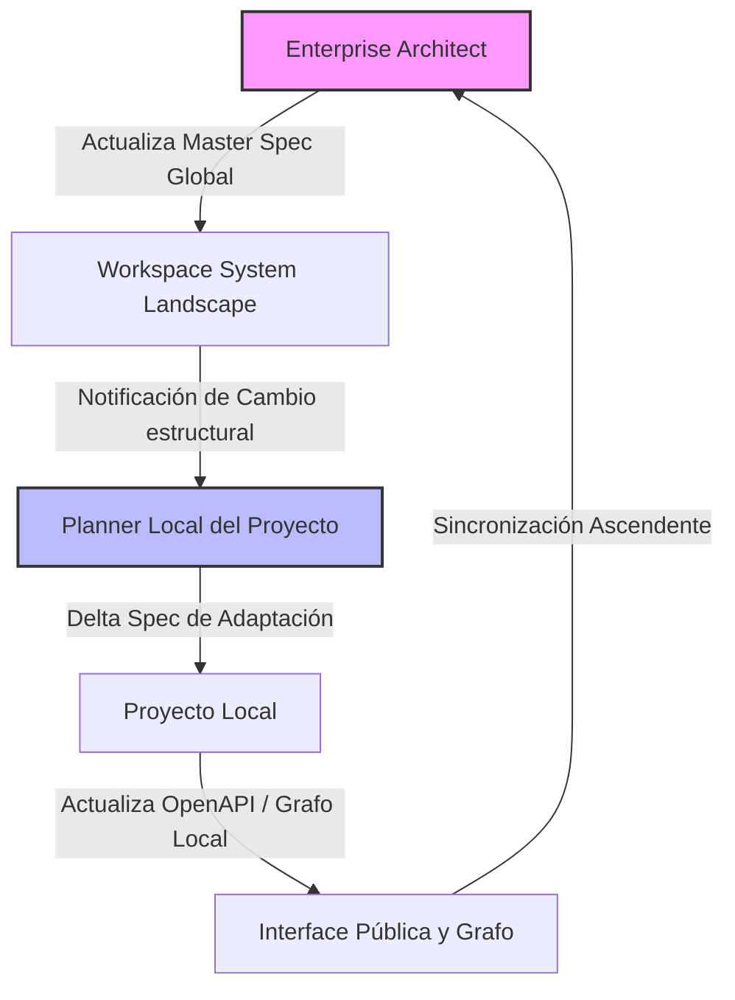

# Estándar de Coordinación de Workspace y Gestión de Deuda Técnica

Este estándar define los protocolos de comunicación, sincronización y control de calidad entre el nivel macro (Enterprise Workspace) y el nivel micro (Proyectos Locales), integrando el uso de grafos de conocimiento (**Graphify**) y un mecanismo formal de **Deuda Técnica**.

---

## 1. El Flujo de Coordinación (Workspace <-> Proyectos)

En entornos de tipo **Solution Workspace** (proyectos ubicados bajo la subcarpeta `projects/`), existe una separación de responsabilidades:
*   **Ámbito Global (Workspace):** El [enterprise-architect](file:///home/cristiansrc/Documentos/config-ai/active/opencode/agents/enterprise-architect.md) gobierna el diseño de alto nivel, el System Landscape, los contratos inter-servicios y la Master Spec global.
*   **Ámbito Local (Proyectos):** Los agentes [planner](file:///home/cristiansrc/Documentos/config-ai/active/opencode/agents/planner.md) y [executor](file:///home/cristiansrc/Documentos/config-ai/active/opencode/agents/executor.md) operan exclusivamente dentro de la frontera de cada proyecto (ej. `projects/user-service/`).

### A. Sincronización Ascendente (Proyecto -> Workspace)
1. Cada vez que un proyecto local es modificado y su especificación es aprobada (`verdict: ready`), el agente `planner` del proyecto debe asegurar que los contratos públicos de API (`openapi.yaml` local) y base de datos estén consolidados.
2. Al ejecutarse la sincronización, el [enterprise-architect](file:///home/cristiansrc/Documentos/config-ai/active/opencode/agents/enterprise-architect.md) del Workspace es invocado para re-escanear las interfaces públicas de los subproyectos.
3. El `enterprise-architect` actualiza el System Landscape global en `docs/specs/master_spec.md` (Workspace) y corre `graphify --update` en la raíz del Workspace para reconstruir el grafo global que mapea las relaciones entre proyectos.

### B. Sincronización Descendente (Workspace -> Proyectos)
1. Si el `enterprise-architect` realiza cambios en el System Landscape global, debe registrar el cambio en un archivo de bitácora global: `docs/specs/workspace_changes.md`.
2. Al iniciar la planificación de un incremento en un proyecto, el `planner` local debe leer `docs/specs/workspace_changes.md`.
3. Si el cambio global afecta los contratos que consume o expone el proyecto:
   * El `planner` must marcar el estado del incremento del proyecto como `planning` o `revision-needed`.
   * El [spec-validator](file:///home/cristiansrc/Documentos/config-ai/active/opencode/agents/spec-validator.md) local del proyecto emitirá un veredicto de `Revision Required: Drift with Workspace` si el contrato local no está alineado con la especificación global.
   * El proyecto deberá iterar en su planeación hasta resolver el desalineamiento.

---

## 2. Gestión Estructurada de Deuda Técnica (Technical Debt)

La deuda técnica (bypasses de arquitectura, baja cobertura de tests, parches rápidos, lógica duplicada o acoplamientos circulares) no se puede ocultar. Debe ser visible a nivel macro y micro.

### A. Registro de Deuda Técnica Local
Cada proyecto contendrá un archivo de registro: `projects/<project-name>/docs/specs/technical_debt.md`.
*   Cualquier agente (`executor`, `refactor`, `final-validation`) que detecte o introduzca deuda técnica de forma temporal, debe registrar una entrada estructurada con:
    *   `id`: Identificador único de deuda (ej. `TD-USER-001`).
    *   `description`: Qué bypass se realizó y por qué.
    *   `impact`: Qué módulos o contratos afecta.
    *   `mitigation_plan`: Cómo y cuándo se resolverá.
    *   `status`: `active` o `resolved`.
*   El [spec-validator](file:///home/cristiansrc/Documentos/config-ai/active/opencode/agents/spec-validator.md) local marcará como inconsistente cualquier incremento que introduzca deuda técnica sin registrarla en este archivo.

### B. Registro de Deuda Técnica Global (Workspace)
En la raíz del Workspace existirá el archivo `docs/specs/technical_debt.md`.
*   El `enterprise-architect` consolidará de forma automática las deudas técnicas locales de todos los proyectos en este archivo global.
*   Si una deuda técnica local tiene impacto inter-servicios o compromete la seguridad global, el `enterprise-architect` marcará la deuda global como `High Risk` e indicará a los proyectos dependientes su estado.

### C. Integración con Grafos de Graphify
*   Los archivos `technical_debt.md` (global y locales) deben ser indexados por Graphify.
*   En el prompt de los agentes se instruirá para que, al realizar un `graphify query`, busquen la relación de deudas técnicas (`technical-debt` nodes) que se intersectan con los módulos que se desean modificar.

---

## 3. Agente Validador: `enterprise-spec-validator`

Para garantizar la estabilidad y consistencia global del Solution Workspace, se introduce un nuevo rol de agente.

*   **Nombre:** `enterprise-spec-validator`
*   **Modelo Sugerido:** `opencode-go/deepseek-v4-pro`
*   **Propósito:** Validar la coherencia macro de la Master Spec del Workspace, el archivo de cambios estructurales `workspace_changes.md`, los contratos compartidos de API, la consistencia de esquemas de bases de datos distribuidas y la consolidación de la deuda técnica global.
*   **Gate de Calidad:** Ningún incremento local de proyecto que afecte a contratos compartidos puede pasar a producción sin que el `enterprise-spec-validator` otorgue el veredicto de `Workspace Aligned` en la Master Spec global del Workspace.
